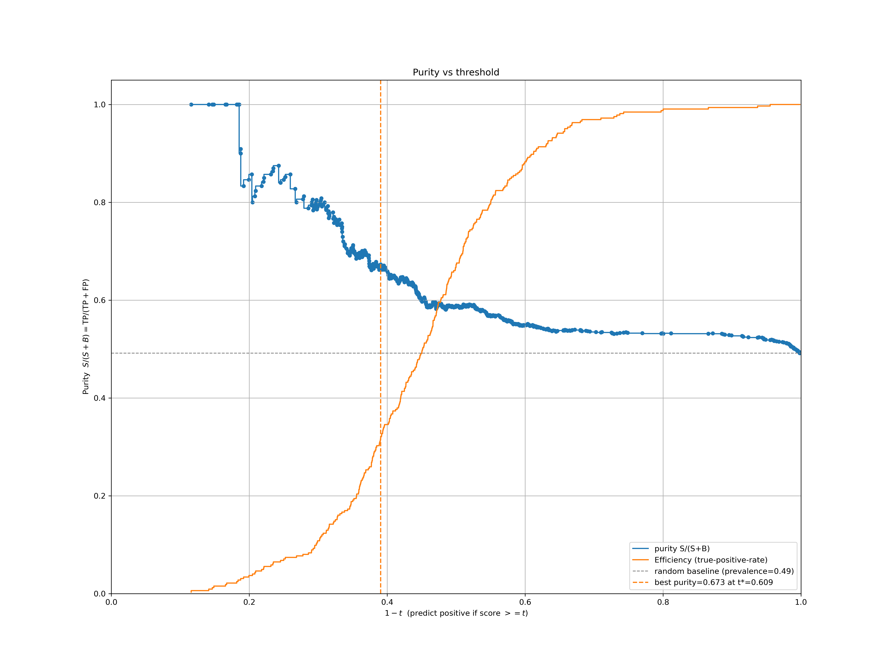

# Neural Network Tagger for Hadronic V→qq̄ Jets

A compact ML pipeline that trains a neural network to tag boosted W/Z→qq̄ jets and compares it to a cut-based baseline, then applies the model to ATLAS Open Data.

Learn more about the data source: https://opendata.atlas.cern/

## 🌟 Overview

This project provides an end-to-end workflow to:
- Load MC and data from CSVs (`pythia.csv`, `jets.csv`)
- Build features from event objects (leading jet/lepton kinematics and angular variables)
- Train a small MLP classifier (PyTorch)
- Evaluate training/validation curves, ROC and purity
- Choose a working point and apply to real data

Outputs (plots, CSVs, and model weights) are written under `out/<revision>/`.

## 📁 Project Structure

```
NeuralNetworkTaggerLHC/
├── data-exercise-template-v7.py   # Main script: data loading, MLP training, evaluation, plots
├── jets.csv                       # ATLAS Open Data (flattened events)
├── pythia.csv                     # MC in the same format (+ truth label for jets)
├── README.md                      # This file
├── setup.sh                       # Quick setup script (Linux/macOS)
├── setup.bat                      # Quick setup script (Windows)
├── requirements.txt               # Python dependencies
├── flake.nix                      # Nix development environment (optional)
├── flake.lock                     # Nix lockfile
├── aux/                           # Optional: generators and skimming utilities
│   ├── main213.cc
│   └── skimevents.py
└── report/
    └── report.md                  # Notes/report template (optional)
```

## 🚀 Features

- Lightweight event model (`Particle`, `Event`) and CSV loader
- Cut-based selection (baseline) with configurable kinematic cuts
- MLP classifier in PyTorch with train/val split and scheduler
- Metrics and plots:
  - Training vs validation loss and accuracy
  - Score distribution and chosen threshold t*
  - ROC curve (manual AUC)
  - Purity vs threshold and efficiencies
- Application to real data (`jets.csv`) with before/after selection mass histograms

## 🛠️ Dependencies

Python packages used by the main script:
- numpy
- matplotlib
- scikit-learn
- torch (PyTorch)

An optional Nix flake is provided for fully reproducible dev shells.

## 💻 Setup & Installation

### Option 1: Quick Setup (Recommended)

Linux/macOS:
```bash
# Run the setup script (uses Python venv and pip)
bash ./setup.sh
```

Windows:
```bat
:: Run the setup script (creates venv and installs requirements)
setup.bat
```

After setup, activate the environment:
- Bash/zsh: `source .venv/bin/activate`
- Fish: `source .venv/bin/activate.fish`
- Windows (cmd): `.venv\Scripts\activate`

### Option 2: Manual Setup (pip)

```bash
python -m venv .venv
# Bash/zsh:  source .venv/bin/activate
# Fish:      source .venv/bin/activate.fish
pip install -r requirements.txt
```

If PyTorch fails to install from PyPI on your platform, consult https://pytorch.org for the appropriate install command (CPU/GPU, CUDA version), or use the Nix or conda options below.

### Option 3: Conda (optional)

```bash
conda create -n nn-tagger python=3.12
conda activate nn-tagger
pip install -r requirements.txt
```

### Option 4: Nix (Advanced/Optional)

The repo includes a Nix flake that provides a development shell with all core Python deps:

```bash
nix develop
```

## 🎯 Usage

1) Ensure your environment is activated (venv, conda, or nix shell).
2) Run the main script:

```bash
python data-exercise-template-v7.py
```

Key configurable settings are defined near the top of the script:
- Input files: `MC_FILE`, `DATA_FILE`
- Baseline cuts: `min_pt_j`, `min_pt_l`, `min_dphi`, `eta_j_max`
- Training: `epochs`, `batch_size`, optimizer/scheduler
- Output revision tag: `revision` (controls `out/<rev>/` directory)

## 📊 Output

Artifacts are saved to `out/<revision>/`, including:
- `<title>_model.pt` — trained model weights
- `<title>.png` — training curves (loss/accuracy/LR)
- `<title>_scores.png` — test score distribution with t*
- `<title>_roc.png` — ROC plot (manual AUC)
- `<title>_purity.png` — purity vs threshold with working point
- `<title>_jetmass.png` — data mass histogram before/after cuts
- CSVs: training history, ROC points, purity curve (if writing succeeds)

## 📈 Results (sample outputs)

Below are example figures produced by `data-exercise-template-v7.py` (see also `report/report.md`). Paths assume the default `revision='17'`:





If these images are not present yet, run the script to generate them; they will be written under `out/<revision>/`.

## 🧪 Data format (CSV)

Each row contains a single reconstructed particle. Events are grouped by `event_id` and split into large-R jets (pid=±90) and leptons (others). For each event, the script builds a feature vector from the leading jet and leading lepton.

## ⚙️ Tips & Notes

- Reproducibility: seeds for `random`, `numpy`, and `torch` are set to 42.
- GPU is optional; the model is tiny and trains fast on CPU. For GPU, install the appropriate CUDA-enabled PyTorch wheel.
- If you change the feature set, adjust the network input dimension accordingly.

### Troubleshooting

- Linux: if `ImportError: libstdc++.so.6` appears when importing NumPy, install your system's C++ runtime (e.g., `sudo apt install libstdc++6`). Using the provided Nix flake also avoids these issues.
- Fish shell: activate with `source .venv/bin/activate.fish`.
- Force CPU-only torch wheel on Linux: run `TORCH_CPU=1 bash setup.sh`.

## 📄 License

This project is licensed under the terms in the `LICENSE` file.

## 🤝 Acknowledgments

Built for educational purposes using ATLAS Open Data. Thanks to the open data community for resources and inspiration.

---

*Part of Applied Computational Physics and Machine Learning coursework*