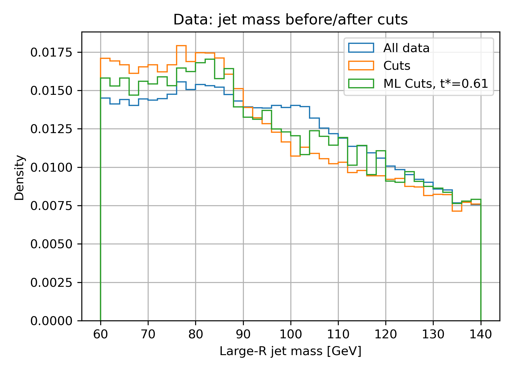

# Project Report Neural-Network Tagger Konstantin Unruh

## Feature, splits and NN architecture
### Feature vector
The feature array is the same example vector given in the assignment notes. 

$$
x = \big(p_{T}^{j},\, \eta_{j},\, \phi_{j},\, p_{T}^{\ell},\, \eta_{\ell},\, \phi_{\ell},\,
\Delta\phi(j,\ell),\, \Delta R(j,\ell),\,
\frac{p_{T}^{j}}{p_{T}^{\ell}},\, \frac{p_{T}^{j}-p_{T}^{\ell}}{p_{T}^{j}+p_{T}^{\ell}}\big).
$$

### Data split

The data is split into three sets: The training, validation and testing dataset. 
The train_test_split() function also shuffles the feature rows before selecting 
80% training data, 10% validation and 10% testing data.

```python
n = len(x_mc)
train_idx, valid_test_idx = sklearn.model_selection.train_test_split(np.arange(n), train_size=0.8, test_size=0.2)
valid_idx, test_idx = sklearn.model_selection.train_test_split(valid_test_idx, train_size=0.5, test_size=0.5)
```


### NN architecture

The NN architecture is the same as the example in the assignment notes, except an 
increased dropout parameter of $p=0.2$. 
Linear(10 → 32) → ReLU → Dropout(p = 0.2) → Linear(32 → 16) → ReLU → Linear(16 → 1). 
When evaluating the output activity a manual sigmoid function is used to keep the 
values between 0 and 1. The recommended activity function is used. The initial 
learning rate is set to $1\cdot10^{-3}$. The learning rate is reduced based on 
the validation loss instead of using an early stopping algorithm. In total the 
NN has a number of trainable parameters of 897.


```python
h1, h2  = 32, 16  # Two hidden layers with h1 and h2 neurons

model = nn.Sequential(
        nn.Linear(in_dim, h1),
        nn.ReLU(),
        nn.Dropout(p=0.2),
        nn.Linear(h1, h2),
        nn.ReLU(),
        nn.Linear(h2, 1),
)
...
loss_function = nn.BCEWithLogitsLoss()
optimizer = torch.optim.Adam(model.parameters(), lr=1e-3)
scheduler = optim.lr_scheduler.ReduceLROnPlateau(optimizer, mode='min', factor=0.25, patience=12)
...
epochs = 150
...
scheduler.step(losses_valid[epoch])
```

The loss, accuracy and learning rate during the training is shown in the following figure 


## ROC and purity plots
### ROC with AUC

The ROC plot on the MC test splits:


We want the true positive rate to be larger than the false positive rate, for 
different threshold values, so the graph is above the mid-line. The AUC is 
$0.661$.

### Purity plot

The purity plot shows the purity depending on the threshold value 
used to determine a boolean true or false value based on a probability 
value. The working point $t^*$ is set by maximizing the purity under 
the condition that the true positive rate is larger than $30\%$. Our 
goal is to get a high purity. To get the highest purity we can 
only select the events where the neural network is very sure it is 
a true event, i.e. use a high threshold value. However if this is 
overdone we miss a lot of true events where we are not so sure it is 
a true event. So a tradeoff is necessary to get a sensible output.


The working point $t^*$ for our test split is $t^* = 0.609$.

This additional plot shows the distribution of the score probability, the mean 
and standard deviation and the events above threshold $t^*$ in green. 


## Jet mass plots

The ML cut keeps more of the $80-85 GeV$ signal compared to the cut-based 
selection, which is the energy range we are interested in.




## Purity numbers

The purity for the test split using the cuts vs. using the NN selection is:

| Selection  | Purity S/(S+B) | S   | B   | N   |
|------------|---------------:|----:|----:|----:|
| MC (cuts)  | 0.531          | 169 | 149 | 318 |
| MC (Machine Learning) | 0.673          | 103 | 50  | 153 |

For the NN selection we get with 67.3 % a much better purity compared to the cuts selection.